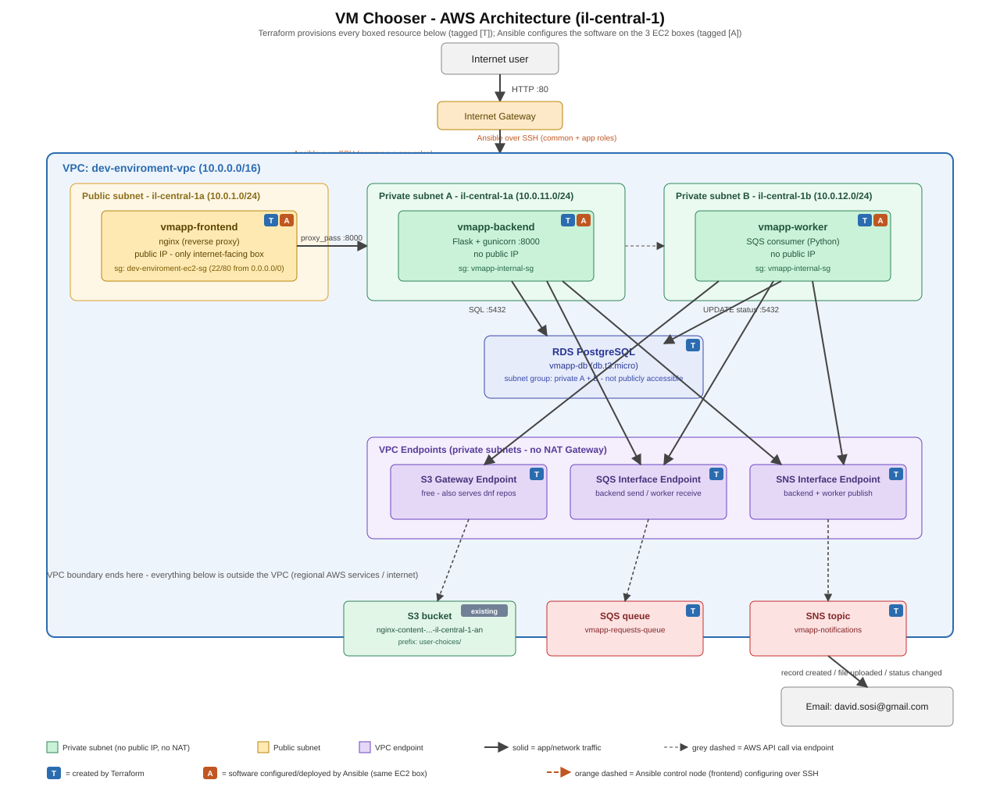
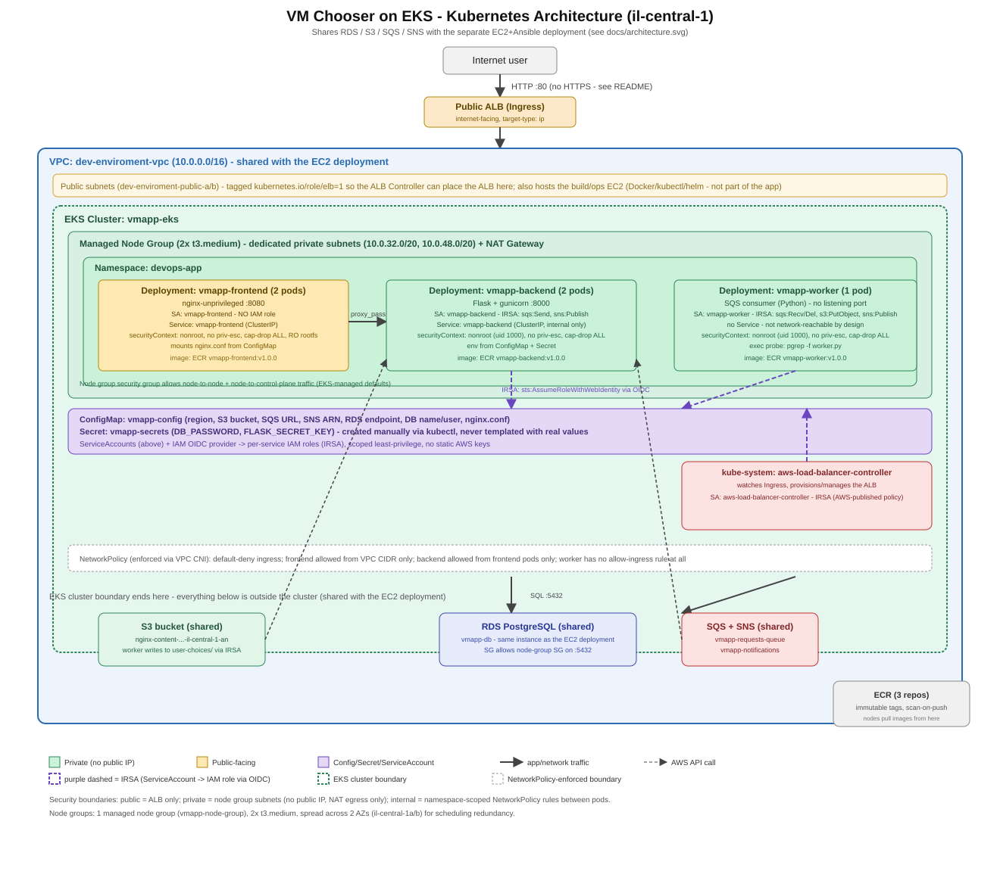
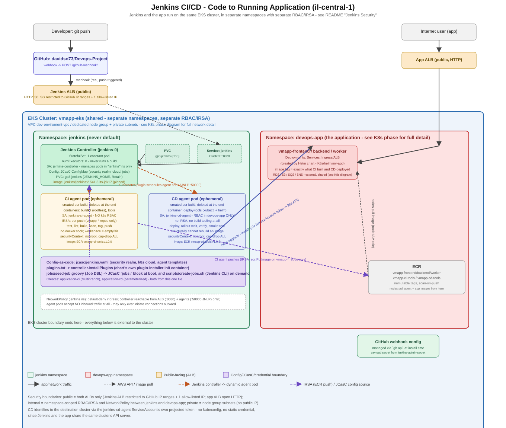

# VM Chooser - 3-Tier Demo App on AWS (Terraform + Ansible)

A small demo web app: users register/log in, then submit a form choosing a fake
"VM" (name, architecture, instance type). Nothing in the form actually creates
an EC2 instance - it's purely for testing the app's plumbing and collecting
data. Submissions flow through SQS to a worker, land in S3, and trigger email
notifications via SNS at each step. Deployed across 3 EC2 instances
(frontend/backend/worker) with RDS PostgreSQL for storage.

**Terraform provisions the infrastructure; Ansible configures and deploys the
software onto it.** Neither tool does the other's job: Terraform's EC2
resources carry no bootstrap script at all, and Ansible never creates or
deletes an AWS resource.



## Architecture

- **Network**: everything runs inside the existing `dev-enviroment-vpc`
  (`10.0.0.0/16`, region `il-central-1`). This project added two **private**
  subnets (`10.0.11.0/24` in `il-central-1a`, `10.0.12.0/24` in `il-central-1b`)
  alongside the VPC's existing public subnets.
- **No NAT Gateway.** Backend and worker have no public IP and no route to
  the internet at all. Outbound access to AWS APIs goes through **VPC
  endpoints** instead: a free S3 Gateway Endpoint (which also happens to serve
  Amazon Linux's S3-backed `dnf` repos) plus Interface Endpoints for SQS and
  SNS - the only two AWS services backend/worker call directly. This is
  cheaper than a NAT Gateway and keeps the private tier fully off the public
  internet.
- **Three EC2 instances**, one per service:
  - `vmapp-frontend` - public subnet, public IP, runs **nginx**.
  - `vmapp-backend` - private subnet A, runs the Flask app behind gunicorn.
  - `vmapp-worker` - private subnet B, long-polls SQS and does the background work.
- **Security groups** enforce the "frontend is the only thing the internet can
  reach" requirement: `dev-enviroment-ec2-sg` (frontend) allows 22/80 from
  anywhere; `vmapp-internal-sg` (backend + worker) only accepts traffic on the
  app port and SSH from the frontend's security group, plus a self-referencing
  rule so backend and worker can reach each other. Neither backend nor worker
  is reachable from the public internet under any circumstances.
- **RDS PostgreSQL** (`db.t3.micro`) sits in a DB subnet group spanning both
  private subnets, not publicly accessible, reachable only from
  `vmapp-internal-sg`.
- **SQS** decouples the web request from the slower work (writing to S3,
  updating status) so the form submission returns immediately.
- **SNS** (`vmapp-notifications`) has an email subscription to
  `david.sosi@gmail.com` and gets a `Publish` call for all three required
  events: a new DB record, a new S3 file, and a status change.
- **S3**: the app reuses the existing `nginx-content-832767338129-il-central-1-an`
  bucket, writing one JSON file per submitted request under the
  `user-choices/` prefix.
- **Ansible control node**: someone has to actually run `ansible-playbook`
  with network access to the private subnet. We use the **frontend instance
  itself** as the control node - it already has real internet access (to
  install packages and build the dependency wheelhouse) and can reach
  backend/worker directly over their private IPs, with no bastion/jump-host
  setup needed. See "How to run Ansible" below.

### Why nginx runs on the frontend

The frontend is the *only* instance with a public IP and the only one meant to
be reachable from the internet, so it's the only place that makes sense to
terminate public HTTP traffic. nginx there reverse-proxies everything to the
backend's private IP on port 8000 - the backend itself is never exposed
directly.

### Connection flow

1. Browser -> `http://<frontend-public-ip>/` (port 80, nginx).
2. nginx -> backend private IP `:8000` (gunicorn/Flask).
3. Backend -> RDS (`psycopg2`, port 5432) to read/write `users` and `vm_requests`.
4. On form submit, backend -> SNS (**"new DB record"** notification) and backend -> SQS (`SendMessage`), both over the private VPC endpoints - no internet involved.
5. Worker long-polls SQS (`ReceiveMessage` over the endpoint), and for each message:
   a. Worker -> S3 (`PutObject` to `user-choices/<id>.json` via the S3 gateway endpoint) -> SNS **"file uploaded to S3"** notification.
   b. Worker -> RDS (`UPDATE ... SET status='COMPLETED'`) -> SNS **"status changed"** notification.
6. SNS emails `david.sosi@gmail.com` for each of the three events above.
7. Separately, and unrelated to the app's own runtime traffic: the Ansible
   control node (frontend) reaches out to backend and worker over SSH to
   configure them and push the app code - see below.

## What Terraform creates

Everything under `terraform/` - the infrastructure shell, nothing about the
software running on it:

| Category | Resources |
|---|---|
| Network | 2 private subnets, a route table, an S3 gateway endpoint, SQS + SNS interface endpoints, a security group for the endpoints |
| Security | `vmapp-internal-sg` (backend/worker), an added ingress rule on the existing RDS security group |
| Compute | 3 bare EC2 instances (`vmapp-frontend`/`backend`/`worker`) - **no `user_data`, no software installed** |
| IAM | `vmapp-backend-role` / `vmapp-worker-role` (+ instance profiles) scoped to exactly the SQS/SNS/S3 actions each service needs |
| Data | RDS PostgreSQL instance + DB subnet group, an SQS queue, an SNS topic + email subscription |
| Secrets | `random_password` for the DB and the Flask session secret |
| Ansible handoff | 3 generated files (see "Handoff to Ansible" below) |

It does **not** install nginx, Python, or the app; does **not** create the
`vmapp` OS user; and does **not** start any service. That's entirely Ansible's job.

## What Ansible does

Everything under `Ansible/`, run against the bare instances Terraform created:

1. **`common` role (all 3 servers):** updates all OS packages, installs base
   packages (`python3.11`, `python3.11-pip`, `unzip`, `tar`, `vim`), creates a
   dedicated **`vmapp` system user/group** to run the application (never
   root), and creates `/opt/app` and `/etc/vmapp`.
2. **`nginx` role (frontend only):** installs nginx, removes the default
   site, templates `/etc/nginx/conf.d/vmapp.conf` as a reverse proxy to the
   backend (its address is read live from the inventory, not hardcoded), and
   enables/starts the service.
3. **`app` role (backend + worker):**
   - builds an offline Python dependency wheelhouse **once**, on the control
     node itself (`delegate_to: localhost`), targeting the exact runtime the
     instances use (`manylinux2014_x86_64`, Python 3.11) regardless of what
     OS the control node happens to be;
   - copies the app source (`app/backend` or `app/worker`) and the wheelhouse
     to the server, owned by `vmapp`;
   - creates a venv and `pip install --no-index --find-links=wheelhouse`s the
     requirements - no internet access needed on backend/worker at all;
   - templates `/etc/vmapp/<service>.env` with the RDS endpoint, DB
     credentials, S3 bucket, SQS queue URL, SNS topic ARN, and region (see
     `group_vars/`) - this is what satisfies "the application receives the
     AWS details it needs to work";
   - templates and enables a systemd unit (`vmapp-backend`/`vmapp-worker`)
     running as the `vmapp` user.

The playbook is idempotent - running it again with nothing changed reports
`changed=0` across every host.

## Handoff between the two tools

Terraform generates three files under `Ansible/` directly from real deployed
values, so there's no manual copy-pasting of IPs/ARNs between the tools:

- `Ansible/inventory.ini` - `[frontend]`/`[backend]`/`[worker]` groups with
  real IPs.
- `Ansible/group_vars/all/vars.yml` - non-secret app config (region, S3
  bucket, SQS URL, SNS ARN, RDS endpoint, DB name/username).
- `Ansible/group_vars/all/secrets.yml` - the DB password and Flask session
  secret (see "Secrets" below).

All three are gitignored - they contain live infrastructure details and,
for the last one, actual secrets.

## Repository layout

```
app/
  backend/             Flask app (auth, form, summary table)
  worker/               SQS consumer -> S3 + SNS + status update
terraform/             provisions bare infrastructure only
  ansible_templates/    templates for the 3 generated Ansible files above
Ansible/
  ansible.cfg
  inventory.ini          generated by Terraform
  playbook.yml            entry point: common -> nginx -> app
  group_vars/
    all/                  generated (vars.yml, secrets.yml)
    backend.yml, worker.yml   committed: which service + how to start it
  roles/
    common/, nginx/, app/  see "What Ansible does" above
docs/
  architecture.svg      diagram embedded above
```

The repo is organized by tool/concern at the top level so future pieces can
slot in alongside `app/`, `terraform/`, and `Ansible/` without reshuffling
anything: `docker/` and `k8s/` (a containerized version of the app) are the
planned next additions.

## How to run Terraform

Prerequisites: Terraform >= 1.5, AWS CLI, and an AWS profile with permissions
on this account (`dev-profile` is used by default, region `il-central-1`).

```bash
cd terraform
terraform init
terraform plan
terraform apply
terraform output
```

`terraform apply` also (re)generates the 3 files under `Ansible/` described
above. Run it again any time you want to refresh them (e.g. after replacing
an instance).

To tear everything down: `terraform destroy` from `terraform/` (this does not
touch the existing VPC, its public subnets, the S3 bucket, or the unrelated
`david-ec2` instance - only the resources this project created).

## How to run Ansible

Ansible's control node must be Linux/macOS/WSL - it does not support running
natively on Windows. This project uses the **frontend EC2 instance** as the
control node, since it already has internet access (for `dnf`/pip) and can
reach backend/worker directly over the private subnet:

```bash
# From your workstation, after `terraform apply`:
scp -i <path-to-david-key.pem> -r Ansible app <path-to-david-key.pem> \
  ec2-user@<frontend_public_ip>:~/                # copy the project + key up
ssh -i <path-to-david-key.pem> ec2-user@<frontend_public_ip>

# On the frontend instance:
chmod 600 ~/david-key.pem && mv ~/david-key.pem ~/.ssh/
sudo dnf install -y python3-pip
pip3 install --user ansible-core
export PATH=$HOME/.local/bin:$PATH

cd ~/Ansible
ansible-playbook -i inventory.ini playbook.yml
```

If you'd rather run it from your own Linux/WSL machine directly (not via
frontend), it works the same way as long as that machine has internet access
and can reach the private subnet - e.g. add a `ProxyJump` through the
frontend's public IP for the `backend`/`worker` groups in `inventory.ini`,
since an external machine can't reach private IPs directly the way an
in-VPC control node can.

## What variables need to be defined for each tool

**Terraform** (`terraform/variables.tf`, all have sensible defaults - override
with `-var`, a `.tfvars` file, or `TF_VAR_*`):

| Variable | Default | Notes |
|---|---|---|
| `aws_region` | `il-central-1` | |
| `instance_type` | `t3.micro` | frontend, backend, and worker |
| `ami_id` | `""` (empty) | empty resolves to the latest Amazon Linux 2023 AMI via SSM |
| `key_name` | `david-key` | must already exist in the account |
| `db_name` / `db_username` | `vmappdb` / `vmappadmin` | |
| `notification_email` | `david.sosi@gmail.com` | SNS subscription target |

**Ansible** - all variables are supplied via `group_vars/`, none need to be
passed on the command line:

| Variable | Where it comes from |
|---|---|
| `aws_region`, `s3_bucket`, `sqs_queue_url`, `sns_topic_arn`, `rds_endpoint`, `db_name`, `db_username`, `app_user`, `app_group`, `app_dir` | generated by Terraform into `group_vars/all/vars.yml` |
| `db_password`, `flask_secret_key` | generated by Terraform into `group_vars/all/secrets.yml` (secret) |
| `service_name`, `app_exec` | committed statically in `group_vars/backend.yml` / `group_vars/worker.yml` - what to deploy and how to start it |

## How to handle and manage secrets

Two secrets exist: the **RDS master password** and the **Flask session
secret key** (needed so all 3 gunicorn worker processes sign session cookies
identically - without it, logins would randomly "not stick" depending on
which worker handled a given request). Both are generated once by Terraform
(`random_password`) and flow the same way:

- Terraform state (`terraform/terraform.tfstate`) has them in plain text -
  gitignored, never committed.
- Terraform writes them into `Ansible/group_vars/all/secrets.yml` (also
  gitignored) so Ansible can template them into each service's `/etc/vmapp/*.env`
  file on the server (mode `0600`, owned by the `vmapp` user only).
- The SSH private key (`david-key.pem`) additionally gets copied onto the
  frontend instance so it can act as the Ansible control node for
  backend/worker. That's a demo-time tradeoff worth being explicit about: a
  real deployment would prefer SSH agent forwarding (never landing the key on
  a remote host) or running Ansible from a proper bastion/CI runner instead.
- **For real use beyond this demo**, all of the above should move to a
  secrets manager: AWS Secrets Manager or SSM Parameter Store (SecureString)
  for the DB password/Flask key, fetched by the app or by Ansible at
  deploy time instead of living in a plaintext file, and `ansible-vault` to
  encrypt `secrets.yml` itself if it must stay file-based.

## How to check that the system is working

1. `terraform output frontend_public_ip`, then browse to `http://<that-ip>/`.
2. Register a user, log in, submit the form - a row should appear in the
   summary table immediately (status `PENDING`), then flip to `COMPLETED`
   within a few seconds once the worker processes it.
3. `aws s3 ls s3://nginx-content-832767338129-il-central-1-an/user-choices/`
   should show a new `<id>.json` file matching your submission.
4. Check `david.sosi@gmail.com` for 3 notification emails per submission (the
   SNS subscription needs a one-time manual confirmation - AWS emails a
   confirm link; Terraform can't click it for you).
5. From the frontend (the Ansible control node, which has the SSH key and can
   reach the private subnet), use Ansible itself rather than a manual SSH hop,
   from inside `~/Ansible`:
   `ansible backend -i inventory.ini -a "systemctl status vmapp-backend" --become`
   and the equivalent for `worker`/`vmapp-worker` - both should show
   `active (running)` under the `vmapp` user.
6. Re-running `ansible-playbook -i inventory.ini playbook.yml` should report
   `changed=0` for every host if nothing has actually changed - that's the
   idempotency check.

## How to delete the environment when finished

```bash
cd terraform
terraform destroy
```

This removes every resource this project created (both EC2 instances, RDS,
SQS, SNS, the private subnets/endpoints/security groups) without touching the
pre-existing VPC/subnets, the S3 bucket, or unrelated resources in the
account. Ansible has no separate teardown step - once the instances are gone,
there's nothing left for it to manage.

## Estimated running cost

Roughly $50-55/month if left running continuously: RDS `db.t3.micro`
(~$12-15), 3x EC2 `t3.micro` (~$22 combined), two interface endpoints
(~$14.60), plus negligible SQS/SNS/S3 usage. `terraform destroy` removes it
all when you're done testing.

## Component reference

| Component | Purpose |
|---|---|
| `vmapp-frontend` (EC2, public) | nginx reverse proxy; the only internet-facing service; also the Ansible control node |
| `vmapp-backend` (EC2, private) | Flask/gunicorn app: auth, form, summary table, enqueues work |
| `vmapp-worker` (EC2, private) | Consumes SQS, writes to S3, updates DB status, publishes SNS |
| RDS PostgreSQL | `users` and `vm_requests` tables |
| S3 (`nginx-content-...` bucket) | Stores one JSON file per submitted request (`user-choices/`) |
| SQS (`vmapp-requests-queue`) | Queues each submitted request for the worker |
| SNS (`vmapp-notifications`) | Emails `david.sosi@gmail.com` on record-created / file-uploaded / status-changed |
| S3 Gateway + SQS/SNS Interface Endpoints | Give backend/worker AWS API access with no NAT Gateway and no public IP |

## Terraform state

This project uses Terraform's default **local backend** - no `backend` block
is configured, so state lives on disk rather than in S3/Terraform Cloud/etc.

- **Location:** `terraform/terraform.tfstate`, with the previous version kept
  alongside it as `terraform/terraform.tfstate.backup`. Both are the ground
  truth Terraform uses to map its config to real AWS resource IDs - deleting
  or losing this file doesn't delete the AWS resources, but it does make
  Terraform "forget" it manages them.
- **Never committed:** both files are excluded via `.gitignore` - the state
  file contains the RDS password and Flask secret in plain text (see
  "Secrets" above), plus every resource's live attributes.
- **Solo/local only, by design, for this project:** a local backend has no
  locking, so two `terraform apply`/`destroy` runs at the same time (from two
  terminals, or two people) can corrupt it. That's an acceptable tradeoff for
  a single-person demo project; a team or long-lived setup should move to a
  remote backend (e.g. an `s3` backend plus a DynamoDB lock table) so state is
  shared and locked instead of living on one machine's disk.
- **Inspecting it** without changing anything: `terraform show` (the full
  state), `terraform state list` (just resource addresses), or
  `terraform output` (the outputs above). Every `plan`/`apply` also refreshes
  state by re-reading real AWS resources first (the `Refreshing state...`
  lines), so it self-corrects if something drifts.

## Notes from standing this up

- Modifying `user_data` on a running EC2 instance does **not** make
  cloud-init re-run it (it's cached per instance ID) - when we removed
  `user_data` entirely in favor of Ansible, we deliberately replaced all
  three instances (`terraform apply -replace=...`) rather than relying on an
  in-place update, so Ansible would be configuring genuinely bare servers.
- Each gunicorn worker process signs session cookies with its own random key
  unless `FLASK_SECRET_KEY` is set - this caused logins to intermittently
  "not stick" depending on which of the 3 workers handled a given request,
  until a shared secret (generated by Terraform, templated by Ansible) was
  added.

---

# Kubernetes (EKS) Deployment

The same app, containerized and run on EKS via Helm, in a separate top-level
`K8s/` folder. This is an **additional, independent deployment of the same
app** - not a replacement. The 3 EC2 instances above keep running exactly as
described; the k8s pods run alongside them and connect to the **same** RDS
database, S3 bucket, SQS queue, and SNS topic. Both are just separate
front-doors onto shared state - a real request through either one shows up
in the same `vm_requests` table.



## Architecture

- **EKS cluster** (`vmapp-eks`) with a **managed node group** (2x `t3.medium`)
  in 2 new, dedicated private subnets inside the same `dev-enviroment-vpc`
  used everywhere else in this project. Kept separate from the EC2 stack's
  own private subnets because the VPC CNI hands every pod a real VPC IP -
  reusing the small `/24`s from the EC2 phase would risk running out of
  addresses.
- A **NAT Gateway** dedicated to those subnets - EKS nodes need broad AWS API
  reachability (ECR, EKS, STS, CloudWatch, ELB), enough distinct services
  that a NAT Gateway ends up simpler and similarly priced to replicating the
  "VPC endpoints only" pattern used for the simpler 3-tier app.
- All app pods run in a dedicated **`devops-app`** namespace - never `default`.
- **3 Deployments** (frontend/backend/worker), each with its own
  **ServiceAccount**, **Service** (except worker, which listens on nothing),
  fixed-tag container images from **ECR**, resource requests/limits, and
  readiness/liveness probes.
- **AWS Load Balancer Controller** (installed via Helm into `kube-system`,
  itself using IRSA) watches the **Ingress** and provisions a public **ALB**.
- **ConfigMap** (`vmapp-config`) holds all non-secret configuration
  (region, S3 bucket, SQS URL, SNS ARN, RDS endpoint, DB name/user) plus the
  frontend's nginx config. A **Secret** (`vmapp-secrets`, created manually -
  see below) holds the DB password and Flask session key.
- **IRSA** (IAM Roles for Service Accounts) gives backend and worker pods
  their AWS permissions directly - no static access keys anywhere. Frontend
  gets no AWS role at all.
- **NetworkPolicies** enforce (not just document) who can talk to whom, using
  the VPC CNI's native NetworkPolicy support enabled on the cluster.

## What runs inside the cluster vs. stays outside

| Inside EKS | Outside EKS (shared with the EC2 deployment) |
|---|---|
| frontend, backend, worker pods | RDS PostgreSQL |
| AWS Load Balancer Controller | S3 bucket |
| ConfigMap / Secret / ServiceAccounts | SQS queue |
| | SNS topic |
| | ECR (images live here, pulled by nodes) |

## Building and pushing images

Same constraint as Ansible earlier: this Windows machine can't run Docker
natively, so a small **build/ops EC2 instance** (`K8s/terraform/buildhost.tf`)
does it instead - Docker, kubectl, helm, and awscli, with an IAM role that
can push to ECR and administer the EKS cluster (via an EKS *access entry*,
the modern replacement for hand-editing `aws-auth`).

```bash
# From the build host, after scp-ing the repo up:
aws ecr get-login-password --region il-central-1 | \
  docker login --username AWS --password-stdin <account-id>.dkr.ecr.il-central-1.amazonaws.com

for svc in frontend backend worker; do
  docker build -t <account-id>.dkr.ecr.il-central-1.amazonaws.com/vmapp-$svc:v1.0.0 app/$svc
  docker push <account-id>.dkr.ecr.il-central-1.amazonaws.com/vmapp-$svc:v1.0.0
done
```

## Creating the namespace

The Helm chart creates it (`K8s/helm/my-app/templates/namespace.yaml`) - no
separate step needed. Verify with `kubectl get namespaces`.

## Creating secrets

`K8s/helm/my-app/secret.example.yaml` shows the shape of the Secret the app
expects - it's deliberately kept **outside** `templates/` so `helm install`
never actually applies it with those placeholder values. The real one is
created manually, sourcing the same credentials already used by the EC2
deployment (`random_password.db` / `random_password.flask_secret` in the
*original* `terraform/` stack - both deployments share the same DB):

```bash
cd terraform   # the original stack, not K8s/terraform
DB_PASSWORD=$(terraform output -raw db_password)
FLASK_SECRET=$(terraform output -raw flask_secret_key 2>/dev/null || echo "<from Ansible/group_vars/all/secrets.yml>")

kubectl create secret generic vmapp-secrets -n devops-app \
  --from-literal=DB_PASSWORD="$DB_PASSWORD" \
  --from-literal=FLASK_SECRET_KEY="$FLASK_SECRET"
```

**Order matters here**: run `helm install` *before* this command, not after -
the chart's `namespace.yaml` template is what creates `devops-app` in the
first place, and Helm expects to "own" every resource in its release. If you
create the namespace yourself first (e.g. because you need it to exist to
create the secret in it), `helm install` will refuse it with an ownership
error. See "How to run the application" below for the actual working order,
learned the hard way while standing this up.

## How to run the application

```bash
cd K8s/terraform
terraform init && terraform plan && terraform apply

# build + push images (see above), then update K8s/helm/my-app/values.yaml
# with the real ECR repo URLs and IRSA role ARNs from `terraform output`

helm upgrade --install vmapp-app ./K8s/helm/my-app   # creates the devops-app namespace itself

# only now does the namespace exist, so the secret can be created in it:
kubectl create secret generic vmapp-secrets -n devops-app --from-literal=... # see above

# the app pods reference the secret via envFrom but don't restart on their own when
# it changes/first appears - do one rollout after creating it the first time:
kubectl rollout restart deployment/vmapp-backend deployment/vmapp-worker -n devops-app
```

## How to check the system works

See `K8s/evidence.md` for the full, literal output of every command below,
captured against the live cluster.

```bash
kubectl get nodes
kubectl get namespaces
kubectl get pods -n devops-app
kubectl get deployments -n devops-app
kubectl get services -n devops-app
kubectl get ingress -n devops-app
kubectl describe pod <pod-name> -n devops-app
kubectl logs <pod-name> -n devops-app
```

Plus: browsing to the ALB's address over HTTP; a raw `kubectl exec` check
between backend and frontend pods; a full register/login/submit run
producing the same `COMPLETED` row + S3 object + SNS activity as the EC2
deployment; and deleting a pod to confirm the Deployment replaces it and the
app keeps working immediately after.

## How to delete the environment

```bash
helm uninstall vmapp-app -n devops-app
kubectl delete namespace devops-app
cd K8s/terraform && terraform destroy
```

This only removes the k8s phase - the EC2 stack, RDS, S3, SQS, and SNS are
untouched (they're shared, and still serve the EC2 deployment).

## Kubernetes Security

### Separation of privileges (ServiceAccounts)

Three ServiceAccounts, one per service, each with a different (or no) IAM
role - not a single shared identity:

| Service | ServiceAccount | AWS permissions |
|---|---|---|
| frontend | `vmapp-frontend` | **none** - no IRSA role attached at all |
| backend | `vmapp-backend` | `sqs:SendMessage`, `sns:Publish` only |
| worker | `vmapp-worker` | `sqs:Receive/Delete/GetAttrs/ChangeVisibility`, `s3:PutObject` (scoped to `user-choices/*` only), `sns:Publish` |

They do **not** have the same permissions, deliberately. Running every
service with the same broad role (or worse, one shared admin-ish role) means
a compromise of the *least* trusted component (frontend, the only one
directly internet-facing) would hand an attacker the *most* powerful
credentials in the system. Splitting them means a compromised frontend pod
has zero AWS API access - it can't read S3, can't touch SQS/SNS, can't do
anything but proxy HTTP to the backend Service.

### Secrets Management

- Non-secret config -> ConfigMap (`vmapp-config`): region, bucket name, queue
  URL, topic ARN, RDS endpoint, DB name/user. None of this is sensitive.
- Secrets -> a real Kubernetes `Secret` (`vmapp-secrets`): DB password, Flask
  session key. **Created manually via `kubectl create secret`**, never
  templated with real values in the Helm chart or committed to git -
  `secret.example.yaml` shows only the shape, with placeholder strings, and
  lives outside `templates/` specifically so it's never accidentally applied.
- Kubernetes Secrets are base64-encoded, not encrypted, by default. Anyone
  with `get secrets` RBAC in the namespace can read them in plaintext. For
  real use beyond this demo, the next step up is enabling **envelope
  encryption at rest** (KMS-backed, an EKS cluster option) and/or moving to
  **AWS Secrets Manager** via the Secrets Store CSI Driver instead of native
  Secrets.
- The AWS credentials backing the app's actual permissions never live in a
  Secret at all - IRSA vends short-lived, automatically-rotated credentials
  to the pod via its ServiceAccount token, so there's no long-lived AWS
  access key to leak in the first place.

### Network Security

Enforced by `K8s/helm/my-app/templates/networkpolicy.yaml` (see that file for
the exact rules), not just described:

| Who can talk to... | Allowed from |
|---|---|
| frontend | the ALB (arrives as a VPC IP, not a pod - allowed from the VPC CIDR) |
| backend | **only** frontend pods, on port 8000 |
| worker | **nothing** - no ingress rule matches it at all (default-deny) |
| database (RDS) | backend/worker pods, over the VPC network on 5432 (enforced at the security-group level, same as the EC2 deployment's `vmapp-internal-sg` pattern) |

What's exposed to the outside: **only the ALB**, on port 80. Nothing else -
not the pods, not the Services, not the nodes - has a public IP or a route
from the internet.

### Container Security

Every container's `securityContext` sets:
- `runAsNonRoot: true` with a fixed, non-zero UID (backend/worker run as
  UID 1000, set explicitly in their Dockerfiles; frontend uses
  `nginxinc/nginx-unprivileged`'s built-in UID 101 - chosen specifically so
  nginx doesn't need root to bind its port)
- `allowPrivilegeEscalation: false` - a compromised process can't `setuid`
  its way to more privilege than it started with
- `capabilities.drop: ["ALL"]` - none of these services need any Linux
  capability (raw sockets, binding privileged ports, etc.)
- `readOnlyRootFilesystem: true` on frontend (with `emptyDir` volumes for the
  few paths nginx needs to write - cache, pid, tmp); backend/worker keep a
  writable root filesystem for now, a stated trade-off (see below) rather
  than a security decision.

### Image Security

- Images are built from this repo's `app/{frontend,backend,worker}/Dockerfile`
  and pushed to **private ECR repositories** created by Terraform
  (`K8s/terraform/ecr.tf`) - not pulled from a public registry at deploy
  time.
- **Fixed tags only** (`v1.0.0`), never `latest` - `values.yaml`'s
  `image.tag` and the ECR repos' `image_tag_mutability = "IMMUTABLE"` both
  enforce this: an immutable repo physically refuses to let a tag be
  overwritten once pushed, so `v1.0.0` always means the same bytes.
- **Scanned**: ECR's built-in vulnerability scanning (`scan_on_push = true`,
  Amazon Inspector-backed, free) runs automatically on every push. Real
  findings for these images are in `K8s/evidence.md`.

### Ingress Security

- Exposed via a public **ALB** (AWS Load Balancer Controller), HTTP only, on
  port 80.
- **No HTTPS** - there's no domain name or ACM certificate in this AWS
  account, and ACM can't issue a certificate without one. This is a real,
  stated trade-off: a production deployment would register a domain, request
  an ACM certificate, and add an HTTPS listener (443) with an HTTP->HTTPS
  redirect - all the Helm chart infrastructure (`ingress.yaml`) is already
  ALB-based and would need only the certificate ARN annotation added.
- **Access restriction**: none beyond the app's own login - the ALB accepts
  connections from anywhere on port 80. This matches the EC2 deployment's
  posture (nginx also accepts 80 from `0.0.0.0/0`).
- **Public vs. internal separation**: only the ALB is public. The Ingress
  routes exclusively to the frontend Service - backend has no Ingress rule
  and is only reachable from inside the cluster (enforced by NetworkPolicy,
  not just by omission from the Ingress).

## Trade-offs and compromises made

- **HTTP-only Ingress** - no domain/certificate available (see above).
- **Both deployments left running** (EC2 + EKS) sharing one RDS/S3/SQS/SNS,
  per an explicit choice to avoid doubling infrastructure cost while still
  proving the k8s version works end-to-end against real data.
- **NAT Gateway over VPC endpoints** for this phase specifically - EKS's
  broader AWS API surface (EKS/STS/ECR/CloudWatch/ELB, not just S3/SQS/SNS)
  makes the endpoint-only approach used for the EC2 stack less clearly
  cheaper here.
- **Kubernetes Secrets, not Secrets Manager/Vault** - simpler for a course
  project; documented as the natural next step rather than implemented.
- **Backend/worker keep a writable root filesystem** - only frontend got the
  full `readOnlyRootFilesystem: true` treatment; extending it to the Python
  services would need more `emptyDir` mounts for `pip`/temp paths than the
  scope of this phase justified.
- **A dedicated build/ops EC2 instance** just to run Docker/kubectl/helm,
  since none of that tooling runs natively on the Windows machine driving
  this project - the same fix pattern used for Ansible earlier in this
  project, applied again here.

---

# Jenkins CI/CD on EKS

Jenkins runs on the **same EKS cluster** as the app, in its own `Jenkins/`
folder and its own dedicated `jenkins` namespace - never `default`, and
never sharing a namespace with `devops-app`. Two separate, declarative
pipelines cover the whole path from a `git push` to a verified deployment:
**CI** (test, lint, build, scan, tag, push - never deploys) and **CD**
(deploy, verify, rollback - never builds). Everything is created from code:
Helm values, JCasC, RBAC, and the two Jenkins jobs themselves.



## Architecture and EKS

- **Controller**: a single, constant pod (`jenkins-0`, a StatefulSet from
  the official chart) in the `jenkins` namespace, backed by a `PersistentVolumeClaim`
  (`gp3-jenkins` StorageClass, EBS CSI driver) so `JENKINS_HOME` survives
  pod restarts. It runs **zero build/deploy executors**
  (`jenkins.numExecutors: 0` in JCasC) - every build/deploy runs on a
  dynamic agent pod instead.
- **Dynamic agents**: the Kubernetes plugin creates one pod per build, from
  one of two pod templates (`agent-pods/ci-agent-pod.yaml.tpl`,
  `agent-pods/cd-agent-pod.yaml.tpl`), and deletes it the moment the build ends
  (`podRetention: never`). Nothing persists between builds - no cache, no
  leftover state, no secrets on disk after the pod is gone.
- **Same cluster as the app, separate everything else**: Jenkins reuses the
  `vmapp-eks` cluster from the K8s phase (own node group, own VPC) but has
  its own namespace, its own ServiceAccounts/RBAC, its own IRSA roles, and
  its own ECR repos (`vmapp-ci-tools`, `vmapp-cd-tools` for the agent images
  themselves) - it shares infrastructure, not permissions, with the app.
- **How the CD pipeline identifies itself to the destination cluster**: the
  `jenkins-cd-agent` pod runs under a Kubernetes ServiceAccount of the same
  name, which the API server authenticates via its own short-lived,
  auto-rotated projected token - the same in-cluster auth mechanism any pod
  uses to talk to its own API server, scoped down by RBAC to exactly
  `devops-app` (see `rbac/cd-agent-rbac.yaml`). There is no kubeconfig file,
  no static bearer token, and nothing "logged in" from outside the cluster -
  if this pipeline targeted a *different* cluster, it would need a real
  credential (a kubeconfig Jenkins credential), which is exactly why keeping
  Jenkins on the same cluster as the app was the simpler, more secure choice
  here.
- **Security boundary**: the `jenkins` namespace and `devops-app` namespace
  are two separate NetworkPolicy/RBAC domains on the same cluster. A
  compromised Jenkins agent pod cannot reach anything in `devops-app` at the
  network level unless its own NetworkPolicy explicitly allows it (it
  doesn't - see `network-policy.yaml`), and the CD agent's RBAC is the
  *only* identity anywhere in this project with write access to
  `devops-app`, and it's a Kubernetes-native identity, not a portable
  credential that could leak outside the cluster.

## Prerequisites and tool versions

All pinned, none `latest`:

| Tool | Version | Where it's pinned |
|---|---|---|
| Jenkins Helm chart | `5.9.56` | `scripts/install-jenkins.sh` |
| Jenkins controller image | `jenkins/jenkins:2.541.3-lts-jdk17` | `helm-values.yaml` |
| Plugins | see `plugins.txt` | installed via the chart's plugin-installer, generated from this file |
| BuildKit (CI agent) | `moby/buildkit:v0.17.1-rootless` | `agent-pods/ci-agent-pod.yaml.tpl` |
| kubectl / Helm (CD agent) | `v1.31.0` / `v3.15.4` | `agent-images/cd-tools/Dockerfile` |
| CI tools image | `flake8==7.1.1`, `pytest==8.3.3`, `awscli==1.36.7` | `agent-images/ci-tools/Dockerfile` |

You'll also need: `kubectl` and `helm` pointed at `vmapp-eks` (the build host
from the K8s phase already has both), and the EKS/ECR/Helm-chart phases
already applied (this phase assumes `devops-app` and the 3 ECR app repos
already exist).

## Installing Jenkins from code

```bash
cd Jenkins/scripts
bash install-jenkins.sh      # namespace, RBAC, storage, security group, secrets
                              # (auto-generated on a clean install), JCasC, Helm install
bash verify-jenkins.sh       # the exact checks in evidence.md
bash create-jobs.sh          # creates/updates application-ci + application-cd (idempotent)
```

```bash
bash configure-jenkins.sh    # re-applies JCasC (security realm, cloud, agent templates,
                              # jobs) to an already-running controller, no restart needed
bash uninstall-jenkins.sh    # full teardown - see "Full cleanup" below
```

**One thing `install-jenkins.sh` can't do unattended:** the security group
that restricts the Jenkins ALB (see "Network and exposure" below) needs
`ec2:CreateSecurityGroup`/`ec2:AuthorizeSecurityGroupIngress`, which the
build host's IAM role deliberately does not have (it's scoped to
ECR + `eks:DescribeCluster` only - see `K8s/terraform/buildhost.tf`). Create
it once from a role that does have EC2 permissions:

```bash
# same commands install-jenkins.sh would run itself, with EC2 permissions
SG_ID=$(aws ec2 create-security-group --group-name jenkins-alb-sg \
  --description "Jenkins ALB - GitHub webhook ranges + allow-listed UI access only" \
  --vpc-id vpc-078790f7a168052e8 --region il-central-1 --query GroupId --output text)
# then authorize port 80 from GitHub's ranges (api.github.com/meta) + your own IP - see install-jenkins.sh for the exact loop
export JENKINS_ALB_SG_ID=$SG_ID   # pass it through so install-jenkins.sh skips the AWS calls entirely
bash install-jenkins.sh
```

This is the one and only manual step in the whole install - everything else
runs from `install-jenkins.sh` alone, including on a completely clean
cluster (the recovery requirement this project's rubric asks for).

## Creating the jobs and connecting to Git

Both jobs are defined once, in `jobs/seed-job.groovy` (Job DSL), and created
two ways from that single file - no copy-pasted job definitions to drift out
of sync:

1. **Automatically**, via JCasC's `jobs:` block (`jcasc/jenkins.yaml`) -
   runs at controller boot/config-reload.
2. **On demand**, via `scripts/create-jobs.sh` (Jenkins CLI) - idempotent,
   safe to re-run any time without restarting the controller.

- **`application-ci`** - a Multibranch Pipeline pointed at
  `davidso73/Devops-Project` on GitHub, running `Jenkins/Jenkinsfile-ci`.
  Triggered by a **real GitHub webhook** (configured below) with a 1-minute
  SCM-poll as a fallback.
- **`application-cd`** - a parameterized Pipeline running
  `Jenkins/Jenkinsfile-cd`, taking `IMAGE_TAG`/`TARGET_NAMESPACE`/
  `CI_BUILD_NUMBER`/`GIT_COMMIT_SHA` as parameters.

**Wiring up the real webhook** (after `install-jenkins.sh` has an Ingress
address):

```bash
ALB=$(kubectl get ingress jenkins-ingress -n jenkins -o jsonpath='{.status.loadBalancer.ingress[0].hostname}')
gh api repos/davidso73/Devops-Project/hooks -X POST \
  -f name=web -F active=true \
  -f "config[url]=http://$ALB/github-webhook/" \
  -f "config[content_type]=json" \
  -f "config[secret]=$(kubectl get secret jenkins-admin-secret -n jenkins -o jsonpath='{.data.GITHUB_WEBHOOK_SECRET}' | base64 -d)"
```

A `git push` to `main` after this should trigger `application-ci` within a
few seconds (see `Jenkins/evidence.md` for a captured run).

## Creating credentials and secrets (without exposing values)

Only one Jenkins credential is actually needed in this design (see
`credentials/credentials.example.yaml` for its shape) - the GitHub webhook
shared secret, used to verify incoming payloads are really from GitHub. That
short list is a direct consequence of the least-privilege design, not
something trimmed separately: the repo is public (no clone credential), ECR
auth is IRSA (no registry password), and cluster auth is the CD
ServiceAccount's own token (no kubeconfig).

The real secret (`credentials/secret.yaml`) is **auto-generated by
`install-jenkins.sh`** on a clean install (random admin password + random
webhook secret, printed once to the terminal) and is gitignored - it is
never committed, and neither `jcasc/jenkins.yaml` nor either `Jenkinsfile-*`
contains a literal value anywhere.

**To replace a credential** (e.g. rotate the webhook secret): edit
`credentials/secret.yaml` with a new value, `kubectl apply -f` it, then
`bash scripts/configure-jenkins.sh` to make the running controller pick it
up - no restart needed for the webhook secret; **the admin password does**
need `kubectl rollout restart statefulset/jenkins -n jenkins` since it's
consumed as a container env var at pod start, not re-read by a JCasC reload.

**To disable an exposed credential**: rotate it immediately using the steps
above (a new random value invalidates the old one instantly, since there's
no external system depending on this specific secret's value - GitHub just
gets told the new one). If a **GitHub token** were ever added later (e.g.
for a private repo), disable it at `github.com/settings/tokens` first, then
rotate the Jenkins credential referencing it.

## Running CI

```bash
git add . && git commit -m "..." && git push origin main
```

Stages (see `Jenkinsfile-ci`): **Checkout** (prints commit SHA/branch/build
number) -> **Validate** (Dockerfiles + requirements.txt present) ->
**Lint** (`flake8`) -> **Test** (`pytest`, JUnit XML published via the
`junit` step - visible as a test-results trend in Jenkins) -> **Determine
changed services** (`git diff`, or all 3 on the first commit) -> **Build,
Scan, Tag, Push** (BuildKit rootless builds each changed service, tags with
the 12-char commit SHA - `latest` is never produced -  pushes to ECR via the
CI agent's IRSA identity, then prints the ECR scan status and image digest
for each). `post{always}` runs `cleanWs()` regardless of outcome, which also
removes the ECR auth file written during the Build stage - nothing survives
the pod being deleted. On success, if the branch is `main`, it triggers
`application-cd` automatically with the new tag.

## Running CD

Parameters: `IMAGE_TAG` (required, rejected if empty/`latest`/not
SHA-shaped), `TARGET_NAMESPACE` (must be on the in-file allow-list -
currently just `devops-app`), `CI_BUILD_NUMBER` + `GIT_COMMIT_SHA`
(traceability, filled in automatically when CI triggers it).

Stages (see `Jenkinsfile-cd`): **Checkout** (the Helm chart, not app code) ->
**Validate input** (also sets `currentBuild.description` to
`tag=... ns=... by=... ci_build=... commit=...` - visible directly on the
build's summary page in the Jenkins UI, satisfying "every deployment shows
who/which version/where") -> **Manifest validation** (`helm lint` +
`helm template`) -> **Deploy** (`helm upgrade --install`, `--set
image.tag=$IMAGE_TAG`) -> **Rollout** (`kubectl rollout status` per
Deployment) -> **Verify** (every running pod's image must end in
`:$IMAGE_TAG`, or the build fails) -> **Smoke test** (polls the app's own
ALB for an HTTP 200/302, matching how the app itself is verified in the K8s
phase above).

`disableConcurrentBuilds()` prevents two overlapping deploys to the same
environment; scaling this to multiple real environments later would add a
`lock("deploy-${params.TARGET_NAMESPACE}")` step instead, so concurrent
deploys to *different* namespaces can still run in parallel.

## Rollback

Tested once (see `Jenkins/evidence.md` for the captured run): a failed
deployment's `post{failure}` block prints the exact command, using Helm's
own release history:

```bash
helm history vmapp-app -n devops-app        # find the revision to go back to
helm rollback vmapp-app <revision> -n devops-app
kubectl rollout status deployment/vmapp-backend -n devops-app   # confirm it recovered
```

## Behavior in failure cases

- **CI fails** (lint/test/build/scan/push) -> the build is marked failed,
  no image is pushed for a failing build, and `application-cd` is never
  triggered (the `post{success}` block that triggers it doesn't run).
- **Push to ECR fails** -> same as above; failure happens inside the Build
  stage, before CD could ever be reached.
- **CD fails before Deploy** (bad `IMAGE_TAG`, failed `helm lint`) -> no
  `helm upgrade` ever runs, so the environment is untouched.
- **Rollout or smoke test fails** -> the build is marked failed, recent
  namespace events are dumped to the console
  (`kubectl get events --sort-by=.metadata.creationTimestamp`), and the
  exact rollback command is printed - see "Rollback" above.

## What to focus on (from the project rubric)

- **Reproducibility** - `install-jenkins.sh` alone rebuilds Jenkins, RBAC,
  storage, and both jobs from nothing but this repo; `create-jobs.sh`
  independently proves the jobs come from code, not manual UI clicks.
- **Separation of concerns** - CI has no Kubernetes RBAC at all; CD has no
  IRSA/registry-push permissions at all and its agent image has no build
  tooling. Neither pipeline *can* do the other's job, not just "isn't
  supposed to."
- **Traceability** - every CD build's description shows the CI build number,
  git commit, and target; every image is tagged with the commit SHA and its
  ECR digest is printed in the CI build output.
- **Security** - see the full chapter below; least-privilege RBAC/IRSA, no
  secrets in files, no docker.sock, restricted network exposure.
- **Operability** - failures dump events/logs and print the exact rollback
  command; nothing fails silently.
- **Documentation** - this section plus the two Jenkinsfiles' own comments
  are meant to be enough to run this without asking anyone anything first.

## Jenkins Security

### RBAC and permissions

| Identity | Where | Permissions | Why |
|---|---|---|---|
| `jenkins-controller` | `jenkins` ns | create/manage pods in `jenkins` only (`rbac/jenkins-controller-rbac.yaml`) | Just enough for the Kubernetes plugin to schedule agents - not cluster-admin, can't touch `devops-app` |
| `jenkins-ci-agent` | `jenkins` ns | **no Kubernetes RBAC at all** | CI never deploys - it structurally cannot call the k8s API, not just "isn't supposed to" |
| `jenkins-cd-agent` | `jenkins` ns (SA), RBAC granted in `devops-app` ns | get/create/update/patch on deployments/pods/services/ingresses/configmaps/secrets, get on namespaces/events (`rbac/cd-agent-rbac.yaml`) | Exactly what `helm upgrade` + `kubectl rollout status` need in exactly one namespace - no cluster-wide access, no other namespace |

No identity in this project has cluster-admin. See `rbac/cd-agent-rbac.yaml`'s
comments for why it also incidentally gets `secrets` access in `devops-app`
(Helm stores release state as Secrets - an inherent Helm requirement, not a
deliberate widening).

**EKS Pod Identity note**: this project uses IRSA (the OIDC-based
predecessor) rather than the newer EKS Pod Identity feature, for consistency
with the app's own backend/worker IRSA roles set up in the K8s phase -
functionally equivalent for this purpose, documented here since the
instructor's rubric specifically calls out Pod Identity as the recommended
approach.

### Credentials and secrets

Covered in detail above ("Creating credentials and secrets"). Summary:
AWS access is IRSA (never a static key); cluster access is a ServiceAccount
token (never a kubeconfig); the only actual Jenkins credential is the GitHub
webhook secret; the admin/webhook secret file is gitignored and
auto-generated, never committed with real values. Jenkins' own credential
masking (standard behavior for `credentials()`/`withCredentials` bindings)
would redact any credential if one were bound into a shell step - this
project doesn't bind any into either Jenkinsfile at all, which is a stronger
guarantee than masking: there's nothing there to leak in the first place.

### Agent and container security

- **No builds on the controller** - `numExecutors: 0`.
- **No `docker.sock`** anywhere - the CI agent builds via BuildKit rootless
  instead (see "Image Security" in the K8s phase above for why this option
  was chosen over buildah/DinD - same reasoning applies here).
- **`runAsNonRoot` + `allowPrivilegeEscalation: false`** on every container
  in both agent pod templates and the controller itself, with **one
  documented exception**: the BuildKit container needs
  `allowPrivilegeEscalation: true`, confirmed live - rootless BuildKit's
  `rootlesskit` wrapper builds its own user namespace via the setuid-root
  `newuidmap`/`newgidmap` binaries baked into the image, and
  `allowPrivilegeEscalation: false` sets the kernel's `no_new_privs`, which
  disables setuid outright and fails the build before it starts
  (`newuidmap ... operation not permitted`). This container is structurally
  incapable of building an image without some privilege-escalation path;
  rootless BuildKit's is the narrowest one available (no `docker.sock`, no
  privileged mode, no host root) - see immediately below for why that
  option was chosen over buildah/DinD in the first place.
- **Capabilities**: `drop: ["ALL"]` everywhere, with one addition on top for
  the same BuildKit container - `add: ["SETUID", "SETGID"]`, confirmed
  necessary live: a dropped-to-empty capability bounding set blocks
  `newuidmap`/`newgidmap` from gaining those capabilities on exec even with
  `allowPrivilegeEscalation: true` (the kernel intersects a setuid binary's
  capabilities with the process's bounding set). Every other capability -
  on every container, including this one - stays dropped.
- **seccomp**: `RuntimeDefault` everywhere, with **one documented
  exception** - the BuildKit container needs `Unconfined` because rootless
  BuildKit creates a user namespace (the `unshare` syscall) to build images
  without a privileged daemon, which the default profile blocks. This is a
  minimal, specific, explained exception, not a blanket relaxation - every
  other container in this project keeps the default profile.
- **Read-only root filesystem**: the frontend app pod has it (see K8s
  phase); Jenkins agents don't (their workspace itself needs to be
  writable) but their workspace is an `emptyDir`, gone with the pod.
- **Agent and controller images are pinned and scanned**: the controller
  image is the official, actively-maintained `jenkins/jenkins` LTS release;
  the two custom agent images (`vmapp-ci-tools`, `vmapp-cd-tools`) are built
  from pinned base images, pushed to ECR with `scan_on_push` enabled - same
  as every other image in this project (see K8s phase's real scan findings
  for what that actually reports).

### Network and exposure

- Jenkins UI is **not open to all of the internet** - the ALB's security
  group (`jenkins-alb-sg`) allows port 80 only from GitHub's published
  webhook IP ranges (`api.github.com/meta`, re-fetched on every
  `install-jenkins.sh` run) plus one specific allow-listed IP for
  interactive access (the same IP already allow-listed elsewhere in this
  AWS account for RDS access).
- **HTTP, not HTTPS** - same documented gap as the app's own Ingress: no
  domain name or ACM certificate exists in this account, so ACM can't issue
  a trusted certificate. The real fix (a self-signed certificate imported
  into ACM, which doesn't require domain ownership) is documented here as
  the next step rather than implemented, to keep this phase's scope bounded
  - everything else about the ALB (target-type ip, health checks) is
  already set up to take an HTTPS listener with only an annotation added.
- **Endpoints required**: GitHub (`github.com`, `api.github.com`, webhook
  callback inbound from GitHub's ranges above), ECR
  (`*.dkr.ecr.il-central-1.amazonaws.com`, outbound from the CI agent), and
  the Kubernetes API (`https://<cluster>.eks.amazonaws.com`, outbound from
  the CD agent - same endpoint the build host itself uses).
- **NetworkPolicy** (`network-policy.yaml`, enforced via the same VPC CNI
  native support used for the app): default-deny ingress in the `jenkins`
  namespace; the controller is reachable only from the ALB's VPC-internal
  path (port 8080) and from agent pods (port 50000, JNLP); agent pods accept
  **no inbound traffic at all** - they only ever initiate connections
  outward.

## Full cleanup

```bash
cd Jenkins/scripts
bash uninstall-jenkins.sh
```

Removes the Helm release, RBAC, Ingress, NetworkPolicy, ConfigMaps, Secret,
and namespace - leaves the `jenkins-alb-sg` security group and
`gp3-jenkins` StorageClass in place (cheap to keep, needed again on the next
install) and, because the StorageClass's `reclaimPolicy` is `Retain`, the
underlying EBS volume survives even a full uninstall unless deleted
separately (the script prints the exact command). Does not touch
`devops-app`, RDS, S3, SQS, SNS, or the EKS cluster itself - this only tears
down what `Jenkins/` created.

## Trade-offs and significant decisions

- **BuildKit rootless** over buildah/DinD - no daemon, no privileged mode,
  no `docker.sock`; the one cost is the documented `seccomp: Unconfined`
  exception for that single container.
- **HTTP, not HTTPS**, for the Jenkins ALB - no domain/ACM cert available;
  mitigated by restricting the security group instead of by encryption.
- **One combined Job-DSL source of truth**, applied via both JCasC (at
  boot) and the Jenkins CLI (`create-jobs.sh`, idempotent) - satisfies the
  "created by JCasC" / "seed job from the repository" / "CLI script"
  requirements with one script instead of three independent
  implementations that could drift out of sync with each other.
- **A dedicated build/ops EC2 instance**, again, to run
  `helm`/`kubectl`/`docker` - same constraint as the K8s and Ansible phases,
  applied consistently.
- **The Jenkins ALB security group can't be created by `install-jenkins.sh`
  alone** - the build host's IAM role is deliberately minimal (ECR +
  `eks:DescribeCluster` only) and doesn't include `ec2:CreateSecurityGroup`.
  This is the one manual step in an otherwise fully from-code install,
  documented explicitly above rather than silently widening that role's
  permissions just to remove it.
- **A custom `alb.ingress.kubernetes.io/security-groups` annotation replaces
  the ALB's security groups outright**, including the AWS Load Balancer
  Controller's own auto-managed "shared backend" SG that would otherwise let
  the ALB reach the controller pod on its target port. Restricting the ALB's
  *inbound* side (to GitHub's webhook ranges + one allow-listed IP) therefore
  also requires one extra rule on the node security group, opening it to
  *that* ALB SG on port 8080 - `install-jenkins.sh` creates this
  automatically (`NODE_SG_ID` override available, same pattern as
  `JENKINS_ALB_SG_ID`, for the same minimal-IAM-role reason).
- **`!include` (JCasC's own file-inclusion tag) doesn't work with the
  plugin/snakeyaml versions this project resolved to** (bare-name plugin
  pinning - see `plugins.txt` above) - it's rejected outright
  (`YAMLException: Invalid tag: !include`), not merely deprecated. Rather
  than re-introduce version pinning to chase a compatible combination (the
  exact problem bare-name pinning was adopted to avoid), `jenkins.yaml` keeps
  `!include` in its source form for readability, and
  `scripts/render-jcasc.py` inlines those references into a single flat YAML
  document as literal block scalars before the ConfigMap is built - both
  `install-jenkins.sh` and `configure-jenkins.sh` call it. A second, related
  gotcha this surfaced: the chart's config-reload sidecar only syncs
  ConfigMaps carrying a specific label (`jenkins-jenkins-config=true`), and
  independently, JCasC's own directory scan treats every `.yaml`/`.yml` file
  it finds as an independent config source - which is why the two pod
  templates are named `*.yaml.tpl`, not `*.yaml` (a raw Kubernetes Pod
  manifest parsed as a second top-level JCasC document throws a merge
  conflict and silently aborts the *entire* reload, `jobs:` and
  `unclassified:` included, well before ever reaching those sections).
